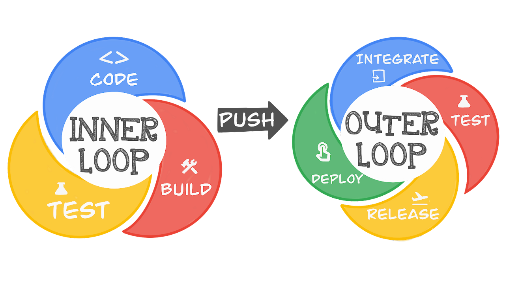

# Coffee Time

The simple app has been created to help demonstrate various aspects of application development and Google Cloud. Its fairly basic by design and of course coffee themed!

Thing are broken down into the "inner" and "outer" loops.



The following are mainly notes/prompts for me personally (I have a terrible memory at times, especially when presenting its easy to forget things), at some time I will make them more generic and parametrise various commands.

The inner loop comprises developer tasks such as coding, testing, and pushing to version control while the outer loop includes activities such as code merge, automated code review, test execution, deployment, and release.

## Inner Loop
The inner loop is everything prior to code being pushed to git and represents the core coding (day-to-day activities), testing, and debugging activities that developers perform as they work on the details of the code. It is a continuous and iterative process where developers rapidly cycle through these activities to make incremental improvements and ensure the code's quality. The goal of the inner loop is to ensure that the codebase remains stable and reliable while quickly responding to changes, fixing issues, and delivering updates to the software product. It is a fundamental part of modern software development practices and contributes to the agility and responsiveness of development teams.

### Cloud Workstations

Test locally from the `/app` directory with `python app.py`.

### Skaffold

### Emulators


### Local build and testing (Cloud Build)

## Outer Loop
Once things have been pushed to git the outer loop takes over. The "outer loop" refers to the broader and higher-level phases or activities that are part of the software development life cycle (SDLC) and within DevOps practices, the "outer loop" can be related to activities related to integration, testing, release, and deployment. 

### Build Image

`gcloud builds submit --tag europe-docker.pkg.dev/secure-cicd-pipeline/hello-coffee/coffee:latest`

Show the build in Cloud Build (quick overview of the UI)
Show the image in AR - also show AR features and opens if setup a new reg


What to look at

### Automate Image build (Cloud build)

show the trigger by making a change (PR)

Two exist - one will create and image and the other will create AND push to CR

### Get into the hands of users (Cloud Deploy)

Cloud Deploy Candidate proposed 

Prep is to create the deploy pipeline;
`gcloud deploy apply --file=clouddeploy.yaml --region=us-east1`

`gcloud deploy releases promote --release=dev-service --delivery-pipeline=run-app-pipeline --region=us-east1`

Create a release 
```
gcloud deploy releases create "initial" --delivery-pipeline="v60-coffee" --region="us-east1" --images="app=europe-docker.pkg.dev/secure-cicd-pipeline/hello-coffee/coffee:latest"
```

```
gcloud deploy releases promote --release=cepf-dev-service --delivery-pipeline=run-app-pipeline --region=us-east1

```

Progressinve rollout


### But what about security?

#### Assured OSS


#### SLSA


## Graveyard


### Setup aspects
Argolis Fixes;
gcloud projects add-iam-policy-binding <project> \
--member="serviceAccount:<project_id>-compute@developer.gserviceaccount.com" \
--role='roles/logging.logWriter'


### Skaffold Playpen/Notes
minikube start


git clone ..
cloudshell open-workspace .


skaffold dev

minikube tunnel

kubectl get service


curl http://EXTERNAL_IP:8080


gcloud builds submit \
    --region=us-west2 --config \
    cloudbuild.yaml


